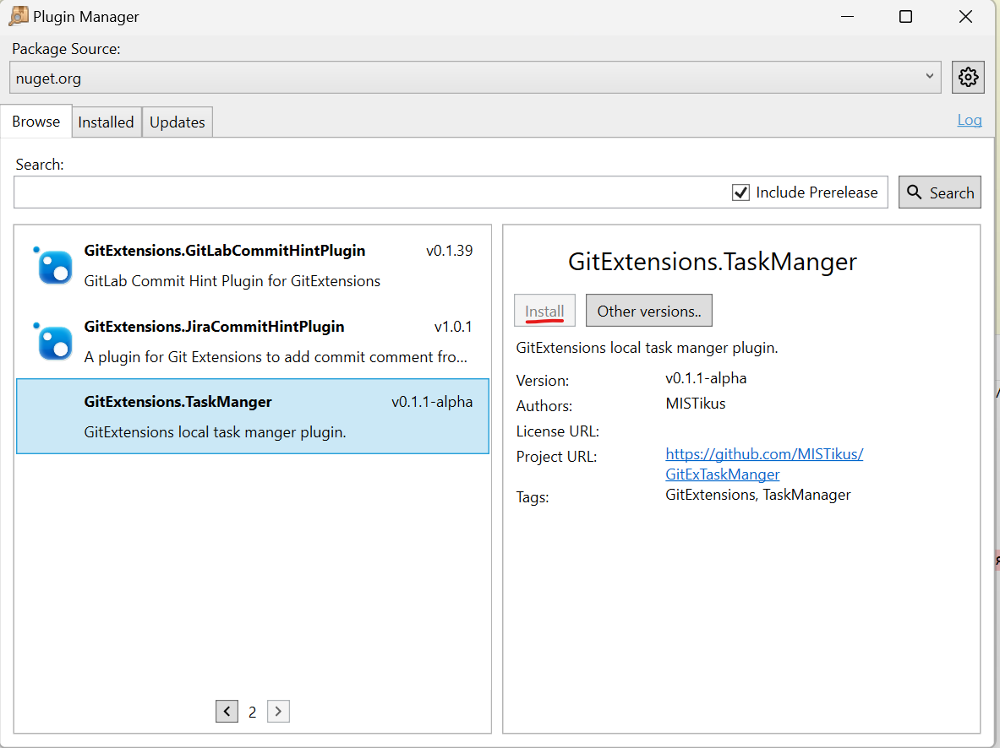

# GitExtensions Task manager Plugin
Simple WinForms local task management tool.

Based on An example/empty repository for building a GitExtensions plugin that can be installed using [GitExtensions.PluginManager](https://github.com/gitextensions/gitextensions.pluginmanager).

Published on [NuGet.org](https://www.nuget.org/packages/GitExtensions.TaskManger) feed.

---

## Installation
Use [GitExtensions.PluginManager](https://github.com/gitextensions/gitextensions.pluginmanager) to install latest version.

---

## Features
- [x] Save backlog to local repo files
- [x] Save issues to local repo files
- [x] Group task items to epics

## History
